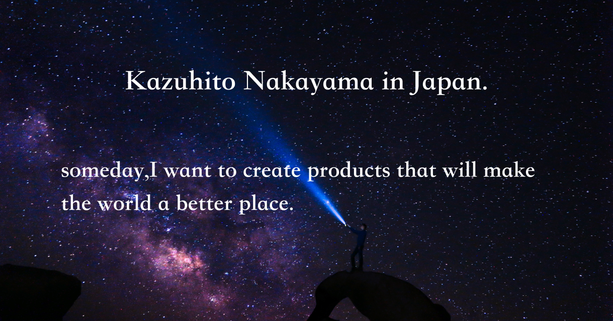

# I'm a Engineer and a Designer 🙋‍

## Language and my activities

##### 
##### I'm OSS contributer in [github/docs](https://github.com/github/docs/)
##### 🔭 I’m currently working on [Atware](https://www.atware.co.jp/)
##### 🌱 I’m currently learning Ruby on rails, React, Java
#####  👯 I’m engineer at [Vcook](https://vcook.jp/), [CLACK](https://clack.ne.jp/), [Geeksalon](https://geek-salon.com/)
#####  📫 How to reach me: Contact Me via [Twitter](https://twitter.com/facultyoflaw11)
